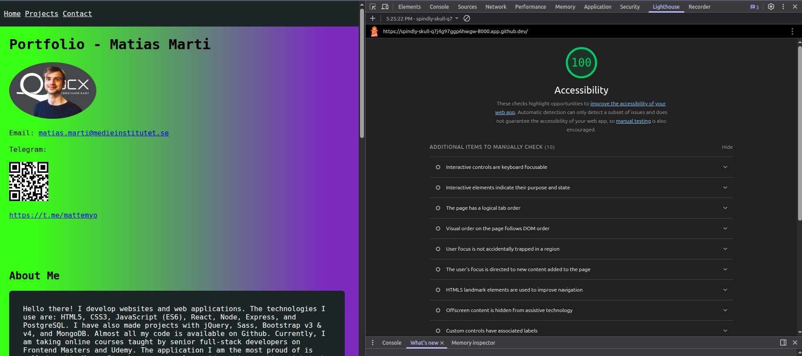

# Assignment

I built this simple portfolio with vanilla html, css, and js. I made a short intro about me with some contact details as well. Additionally, I listed some projects as well as a contact form.

## Files

- 2 figma screenshots (1 for desktop, 1 for mobile). See `figma` folder
- `index.html` file with elements
- `css.html` file with css styles
- Screenshot of lighthouse report `lighthouse-report.png`

### Figma Design URL

https://www.figma.com/site/TpYcSis6sNAuZvxHOPQqay/Portfolio?node-id=0-1&p=f&t=E5MoCmz9yrS0Bd6p-0

## Lighthouse Report

